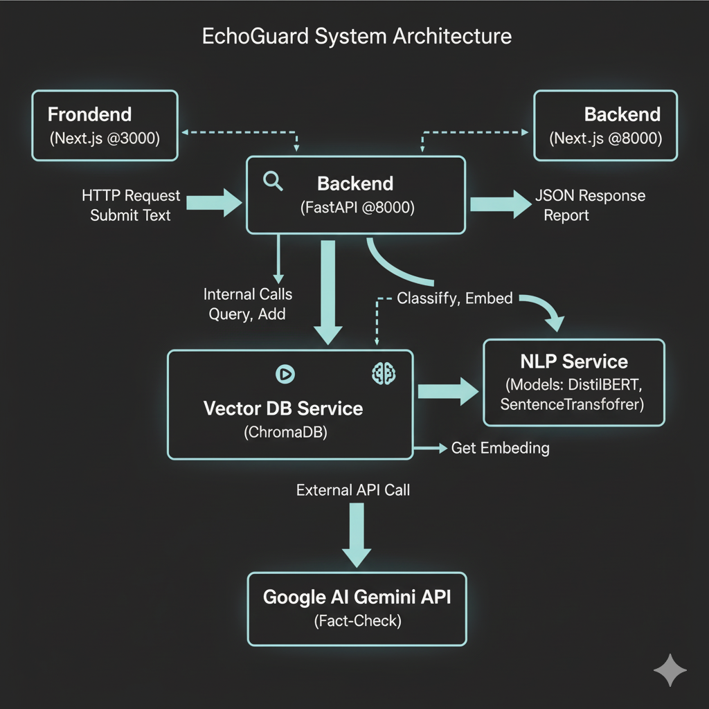

# EchoGuard - Technical Architecture

This document provides a deeper dive into the technical design and components of the EchoGuard application.

## 1. System Overview

EchoGuard employs a decoupled architecture consisting of a frontend user interface, a backend API responsible for processing and analysis, and a vector database for historical context.

(

## 2. Backend (FastAPI)

The backend exposes a REST API and orchestrates the analysis workflow.

* **Framework:** FastAPI (Python) - Chosen for its high performance, async capabilities, and automatic documentation generation.
* **Server:** Uvicorn (run via `start.py` script or Gunicorn in production) - ASGI server.
* **Core Endpoint (`/analyze`):**
    * Receives text input (`ReportRequest`).
    * Uses `asyncio.gather` to concurrently execute:
        1.  **Internal Classification:** Calls `nlp_service.classify_text`.
        2.  **Vector DB Query:** Calls `vector_db_service.query_similar_claims`.
        3.  **Real-Time Check:** Calls `get_realtime_fact_check` (Gemini API).
    * Adds the analyzed claim to the vector DB in the background (`asyncio.create_task`).
    * Aggregates results into a `ReportResponse` and returns JSON.

## 3. NLP Service (`nlp_services.py`)

Handles all machine learning model loading and inference. Implemented as a Singleton to load models only once at startup.

* **Classification Model:**
    * **Model:** `distilbert-base-uncased` (fine-tuned on `chengxuphd/liar2`).
    * **Library:** Hugging Face `transformers`.
    * **Task:** Binary classification (REAL/FAKE) of input text.
    * **Loading:** Loaded from the local `backend/models/my-classifier-model/` directory.
* **Embedding Model:**
    * **Model:** `all-MiniLM-L6-v2`.
    * **Library:** `sentence-transformers`.
    * **Task:** Generates dense vector embeddings (384 dimensions) for semantic similarity search.
    * **Optimization:** Runs on CPU (`device='cpu'`) to conserve GPU memory if available for the classifier (though current setup is CPU-focused).

## 4. Vector Database Service (`vector_db.py`)

Manages interaction with the ChromaDB instance. Implemented as a Singleton.

* **Database:** ChromaDB - Chosen for its simplicity and local persistence capabilities.
* **Persistence:** Configured as a `PersistentClient`, storing data on disk in the `backend/data/chroma_db` directory.
* **Embedding Function:** Uses a **custom embedding function** that wraps our `nlp_service.get_embedding` method. This ensures consistency between the embeddings used for storage and querying.
* **Operations:**
    * `add_claim`: Takes text and its classification label, generates an embedding via the NLP service, and stores the text (document), label (metadata), and a unique ID.
    * `query_similar_claims`: Takes text, generates its embedding via the NLP service, and queries ChromaDB for the `n` nearest neighbors based on cosine similarity (default distance metric).

## 5. Real-Time Fact-Checking (`main.py::get_realtime_fact_check`)

Leverages the Google AI Gemini API for external verification.

* **Model:** `gemini-2.5-flash-preview-09-2025` (specified in API URL).
* **Feature:** Uses **Google Search Grounding** (`"tools": [{"google_search": {}}]`) to base the response on live web results.
* **Prompting:** A system prompt instructs the model to act as a neutral fact-checker and summarize search findings regarding the input statement's credibility. Low temperature (`0.1`) is used for factual consistency.
* **Output:** Extracts the generated summary text and any source URIs provided in the `groundingAttributions`.
* **Resilience:** Includes exponential backoff retries for transient network errors and a fallback mechanism to try a hardcoded API key if the environment-injected key fails with a 403 error.

## 6. Frontend (Next.js)

A standard Next.js application using the App Router.

* **Framework:** Next.js (React) - Chosen for its developer experience, performance features, and ease of deployment.
* **Styling:** Tailwind CSS - Utility-first CSS framework for rapid UI development.
* **State Management:** React `useState` hook for managing input text, loading state, report data, and errors.
* **API Communication:** Uses the browser's `fetch` API to send POST requests to the backend's `/analyze` endpoint (URL configured via `NEXT_PUBLIC_API_URL` environment variable).
* **UI Components:** Uses standard HTML elements styled with Tailwind for a minimal, high-contrast dark theme. `lucide-react` provides icons.
* **Error Handling:** Displays user-friendly error messages if the API call fails.
* **Loading State:** Shows skeleton loaders while waiting for the backend response.

## 7. Data Flow Summary (`/analyze` Request)

1.  Frontend sends `{"text": "User input..."}` to `POST /analyze`.
2.  Backend `main.py` receives the request.
3.  `asyncio.gather` starts three concurrent tasks:
    * Task A (`nlp_service.classify_text`): Tokenizes text -> Runs through DistilBERT -> Returns `{"label": "FAKE", "score": 0.85}`.
    * Task B (`vector_db_service.query_similar_claims`): Calls `nlp_service.get_embedding` -> Gets vector -> Queries ChromaDB -> Returns `[SimilarClaim, ...]`.
    * Task C (`get_realtime_fact_check`): Sends text to Gemini API with Search -> Gets summary & sources -> Returns `RealTimeCheck`.
4.  Backend waits for A, B, and C to finish.
5.  Backend schedules Task D (`vector_db_service.add_claim`) to run in the background (using `asyncio.create_task`): Calls `nlp_service.get_embedding` -> Gets vector -> Adds text, label, ID to ChromaDB.
6.  Backend combines results from A, B, C into `ReportResponse` JSON.
7.  Backend sends JSON response to Frontend.
8.  Frontend receives the report and updates the UI to display classification, real-time check, and similar claims.
